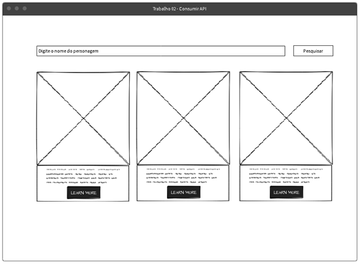

# 🦊 Galeria de Raposas – Consumo de API com JavaScript

Este projeto foi desenvolvido como parte da disciplina de **Programação de Sítios Internet** - FATEC.

---

## 🎯 Objetivo

Criar uma aplicação web utilizando **JavaScript puro (Vanilla JS)** para consumir dados de uma **API pública**, exibindo imagens de forma dinâmica em uma interface moderna e interativa.

---

## 💡 Funcionalidades

- Campo para definir quantidade de imagens
- Consumo de API com `fetch()`
- Exibição dinâmica de imagens (cards)
- Manipulação do DOM com `createElement`
- Tratamento de erros
- Bloqueio de múltiplas requisições
- Uso da tecla **Enter** para busca
- Fonte estilizada

---

## 🛠️ Tecnologias Utilizadas

- HTML
- CSS
- JavaScript (Vanilla JS)

---

## 🌐 API Utilizada

- 🦊 Random Fox API  
https://randomfox.ca/floof/

---

## 🔗 Acesse o Projeto

- 💻 GitHub: [https://github.com/Isabelle-Moraes]
- 🌐 GitHub Pages: [COLE AQUI O LINK]

---

## 📚 Sobre o Projeto

A aplicação permite que o usuário escolha a quantidade de imagens de raposas que deseja visualizar.  
As imagens são carregadas dinamicamente através de requisições HTTP para uma API pública.

Durante o desenvolvimento, foram aplicados conceitos como:

- Requisições assíncronas com `fetch`
- Uso de `async/await`
- Manipulação do DOM
- Eventos de clique e teclado
- Validação de entrada do usuário
- Controle de estado da aplicação

---

## 📸 Preview

---

## 📢 Post no LinkedIn

Confira a publicação sobre este projeto:

👉 [COLE AQUI O LINK DO POST]

---

## 👨‍🏫 Disciplina

**Programação de Sítios Internet**  
Prof. Fernando Leonid – 2026# -Galeria-de-Raposas-Consumo-de-API-com-JavaScript
